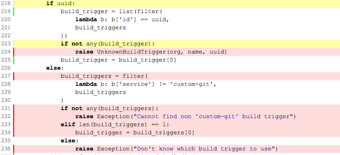

## Unit-tests

You may write unit-tests executed by `tox` to cover all the code that is
used by your crawler.

### Code coverage

Source code of compiled programming language is more or less checked by the
compiler. Here we are using Python, meaning that writing bullet-proof code
is kind of tedious.

One of the interesting indicators is the coverage of your unit-tests, i.e
how much code of your library is executed when the tests are executed.

### Build HTML report

`tox -e stats` commands writes a summary of code coverage to the console output
and generate an HTML report in the `./htmlcov` directory providing full coverage details:

* executed and not executed lines
* lines excluded with the `# pragma: no cover` comment.
* branches partially executed, for instance when the `else` statement of a condition is never executed).



### Frameworks

Here are some pointers to interesting libraries that can help you write
unit-tests efficiently:

* [unit-test](https://docs.python.org/2/library/unittest.html):
the Python core testing library.
* [mock](https://github.com/testing-cabal/mock): a Python mock library, which
is now part of the Python standard library since 3.3.
{{site.data.alerts.tip}} you take a look at the [cogniteev/docido-pull-crawler-trello](https://github.com/cogniteev/docido-pull-crawler-trello)
crawler to see how it can be used {{site.data.alerts.end}}
* [vcr-py](https://vcrpy.readthedocs.org/en/latest/): to record HTTP requests
made by your code, to replay them later one.
{{site.data.alerts.tip}} you can take a look at the [cogniteev/quaycon](https://github.com/cogniteev/quaycon)
project to see how it can be used {{site.data.alerts.end}}

## Execute crawls on your workstation

Docido SDK provides a command line utility named `dcc-run` that allows you
to run crawls on your workstation.

### Installation

You can create a dedicated `virtualenv` environment for that, directly from
your crawler package:

```
cd /path/to/my/crawler
virtualenv .test
. .test/bin/activate
pip install .
hash -r
dcc-run --help
```

### Configuration

The script relies on two configuration files to build the proper testing
environment:

* Global YAML configuration, describing the crawler's environment
(Index API pipeline, extra schemas to check, extra fields to add to the
Elasticsearch mapping...). There are 2 basic configurations:
  * `settings.yml`: the most simple one, without required 3rd parties. Items
    pushed by your crawler are stored locally.
  * `settings-es.yml`: Describe environment where documents emitted by your
    crawler are stored in Elasticsearch. This configuration is required when
    your crawl needs to execute Elasticsearch queries to perform its
    incremental scan.
* ```.dcc-runs.yml``` describing the crawls to launch.

By default, `settings.yml` is used as default crawler environment.
If your crawler needs Elasticsearch, then you can specify another YAML
configuration file in `.dcc-runs.yml`

Once the SDK is installed and the configuration files filled, the crawl can be
run locally via the `dcc-run` command, executed at the crawler module root
directory.

### Launch initial crawl

`dcc-run -v` command launches all crawls
 referenced in `.dcc-runs-yml`.

 {{site.data.alerts.tip}}
 `-v` stands for *verbose*, and it advised as `dcc-run` is pretty shy on logs
 {{site.data.alerts.end}}

All data persisted by your crawler will be stored in the `.dcc-runs` directory.

### Incremental run

You can provide your crawler content of a previous crawl to test incremental
indexing. To do so, provide path to a previous crawl to the `--incremental`
option, for instance:

```
dcc-run -i .dcc-runs/github-full-20151125-121432
```
